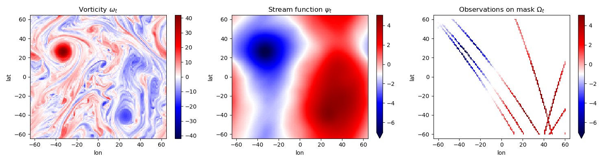
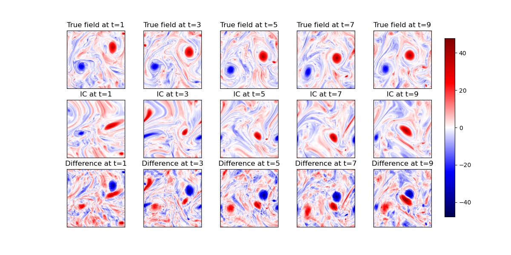
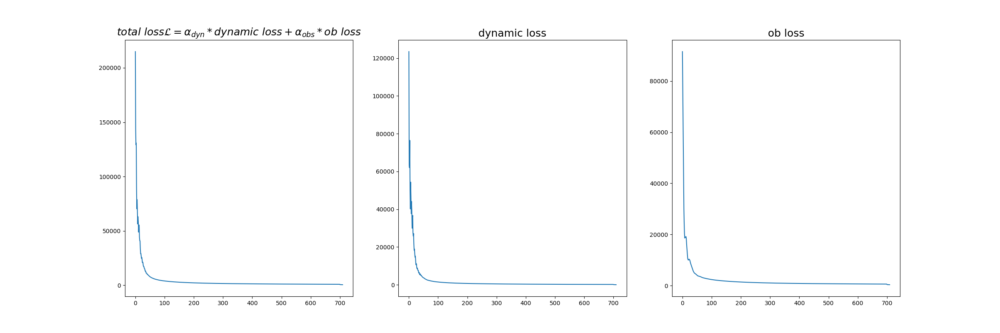
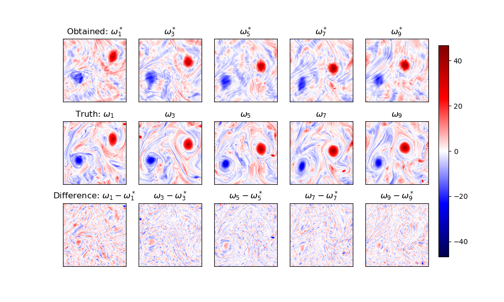

## Variational Data Assimilation
[Data assimilation](https://www.ecmwf.int/en/research/data-assimilation) algorithms are necessary to track or estimate the hidden state of chaotic systems through partial and noisy observations. 
[Variational data assimilation](https://link.springer.com/chapter/10.1007/978-3-030-96709-3_5) aims to find a the best trajectory of the dynamical system which minimizes a certain cost function. 

This repositiory contains a new code for solving the weak-constraint 4dvar or simply weak-4dvar data assimilation for a differentiable QG model. All the code in this repo is implemented in pytorch with handing experiment configurations using hydra. 

## Problem statement: 
Given the sequence of observations Observations sequence \(Y^i=\left(y^i_0,y^i_1,...y^i_n\right)\) on \(\left(\Omega^i_n\right) \in \Omega\), find the optimal trajectory  \(X^i=\left(x^i_0,x^i_1,...x^i_n\right)\) that minimizes the following cost function. 
The weak-4dvar cost function is:

$$\mathcal{J}(x^i_0,x^i_1,...x^i_n)=\sum_{k=1} \alpha_{dyn} \| x_k - \mathcal{M}(x_{k-1}) \|^2+ \alpha_{ob} \|y_i-\mathcal{H}(x_i)\|^2$$

The dynamical systems \( \mathcal{M} \), the dynamical propagator which takes the system state \(x_k\) to \(x_{k+1}\).
The above weak formulation of the 4dvar problem accounts for additional model errors in the dynamical system as the dynamics is not perfect, hence there dynamical cost term. 

The first term minimizes the depatures from a pure model trajectory since the aim to find a trajectory close to the model trajectory while accounting for the model error- a part we refer to as the dynamical cost. The second term makes the trajectory fit to the obsrvations while accounting for the observation error and is referred as observation cost.  

## Quasi-geostrophic model: the underlying dynamical system for OSSE.
To rigorously evaluate and benchmark state estimation algorithms, it is crucial to move beyond over-simplified dynamical systems like the Lorenz-63 or Lorenz-96 models, which are low-dimensional ODEs (3 and 40 dimensions, respectively). With recent trends of deep learning, traditional data assimilation problems that need adjoint computation may bypass this step by leveraging AD(automatic differentiation)- the work-horse of modern machine learning. The Quasi-Geostrophic (QG) model offers a more realistic and challenging alternative. As a PDE-based model, the QG system captures essential features of large-scale geophysical fluid dynamics while remaining computationally tractable. It serves as a model of intermediate complexity, bridging the gap between toy models and full-scale numerical weather prediction systems.

In the QG model, the vorticity field is the fundamental dynamical variable, evolving under nonlinear advection and forcing, and governed by conservation laws. Observations, however, are typically taken in the streamfunction space, which is related to vorticity through an elliptic inversion (a form of diagnostic relationship). This setup introduces a realistic observation operator and offers a natural framework for exploring the performance of data assimilation techniques in the presence of model and observation noise. The QG model is thus particularly well-suited for testing advanced machine learning and deep learning methods for data assimilation I started out with the codes of [Hugo Frezat](https://github.com/hrkz/torchqg) for QG, but I have made significant changes to the code to make it compatible with the weak-4dvar problem and to integrate it with neural ode package.

Domain \(=\left[0,2 \pi\right)^2\), \(\omega \): vorticity, \(\psi\): stream-function.

$$
\frac{\partial \omega}{\partial t}+ J(\psi, \omega)= \nu \nabla^2 \omega - \mu \omega - \beta \partial_x \psi \,, \quad \omega = \nabla^2 \psi \, \quad $$

The current implementation has Quasi-geostrophic model on a grid of $128$ X $128$  dimension. The ground truth is a $1024$ X $1024$ simulated voriticity and stream function coarse grained on the low resolution grid. The PDE has PBC and we use psueod-spectral methods to solve them( all in pytorch.)


These observations are available on masks which have been obtained from Nadir Satelite altimetry tracks. The nature of these observations are realistic- they are really quite sparse! 
Below is a snapshot of vorticity field, the stream function and the kind of observations we have for any time. The observations and the masks are different at different times.



We solve the weak-4dvar problem for 10-day assimilation window. The  
The default implementation performs optimization of the loss function of the weak-4dvar using SGD based algorithm, although this can be easily changed to a different optimizer that is written or available in pytorch. 

So, here is a demonstration of the problem: we start with an IC for 10 days of assimilation window.



We then optimizer the weak 4dvar loss function during the optimization. The loss function is computed at every time step and the optimization is performed for 10 days of assimilation window.


And finally, what we get at the end of the optimization is something like below.



The paramters for any numerical experiments is loaded as a 'config.yaml' file and hydra is used to initialise experiments. The code is both CPU and GPU compatible. 
Here is a result from one of the initial conditions, (discussed further below ):
We have explored different initial conditions at the moment:

1. True i.c. - just to check for consistency and stability.
2. Blurred i.c. - to test stability and convergence to the true solution.
3. Gaussian random field- a prior with temporal correlation on the initial state.
4. Coherent-shifted field- to mimic psition based errors.

The last kind of error is the focus of my experiments. How I am simulating these kind of errors is part of another repository here-[https://github.com/Mr-Markovian/spatially-coherent-random-perturbations]. 
But this kind of IC is specific to our study and not necessary for the weak-4dvar algorithm in general. 


The folder structure is a as follows:

To experiment with new models, we need two things:
1. The dataset and the dataloader within it for the observations of the system.
2. A pytorch implementation of 'your_dynamical_system.py' using pytorch's nn module.

The neuralode package [torchdiffeq](https://github.com/rtqichen/torchdiffeq) is what I use to handle the derivative computation. At this moment, the code is purely designed for my own experiments. If you find it useful and want to collaborate on an interesting idea in the space of data assimilation and dynamical systems, reach out to me via email or linkedin :)

Currently, my publication is under preparation and will be submitted soon, but incase you use my code for your own experiments, do not hesitate to use the following citation:
```bibtex
@inproceedings{Roy2025,
  author = {Roy, S. K. and Fablet, R.},
  title = {Performance Gains and Advantages of 4DVarNet in End-to-End Learning for Data Assimilation},
  booktitle = {EGU General Assembly 2025},
  location = {Vienna, Austria},
  date = {27 Apr--2 May 2025},
  id = {EGU25-4300},
  doi = {10.5194/egusphere-egu25-4300},
  year = {2025}
}

```

<script type="text/javascript" async
  src="https://cdnjs.cloudflare.com/ajax/libs/mathjax/2.7.7/MathJax.js?config=TeX-MML-AM_CHTML">
</script>