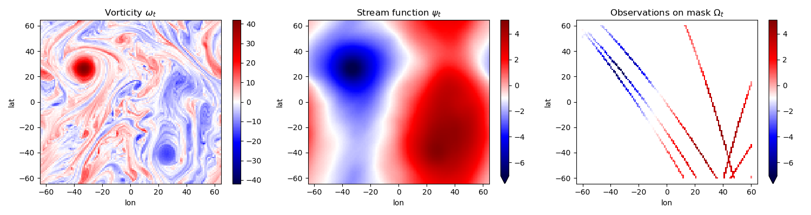

## Variational Data Assimilation

Variational data assimilation aims to fit a model trajectory to the observations.

### This repositiory contains a new code for weak-constraint 4dvar or simply weak-4dvar data assimilation that is implemented in pytorch with handing experiment configurations using hydra.

If you want to go beyond L63 and L96 models, here is interesting model case for studying performace of a an intermediate complexity model's state estimation problem in machine learning, deep learning problem in data assimilation.
Below is a snapshot of vorticity field, the stream function and the kind of observations we have for any time. The observations and the masks are different at different times. 

## Problem statement: 
Given the sequence of observations Observations sequence $Y^i=\left(y^i_0,y^i_1,...y^i_n\right)$ on $\left(\Omega_i\right) \in \Omega$, find the optimal trajectory  $X^i=\left(x^i_0,x^i_1,...x^i_n\right)$ that minimizes the following cost function. 
The weak-4dvar cost function is:

$$\mathcal{J}(x^i_0,x^i_1,...x^i_n)=\sum_{k=1} \|\|x_k - \mathcal{M}(x_{k-1})\|\|^2+ \|\|y_i-\mathcal{H}(x_i)\|\|^2$$

The dynamical systems $\mathcal{M}$ takes the system state $x_k$ to $x_{k+1}$.
Where as the above weak formulation of the 4dvar problem accounts for additional model errors in the dynamical system. 

The first term minimizes the depatures from a pure model trajectory since the aim to find a trajectory close to the model trajectory while accounting for the model error- a part we refer to as the dynamical cost. The second term makes the trajectory fit to the obsrvations while accounting for the observation error and is referred as observation cost.    

The paramters for any numerical experiments is loaded as a 'config.yaml' file and hydra is used to initialise experiments. The code is both CPU and GPU compatible. 

The current implementation has Quasi-geostrophic model on a $128$ X $128$ grid. The vorticity is the dynamical variable and the observations are in the stream function space with some noise added to them.

These observations are available on masks which have been obtained from Nadir Satelite altimetry tracks. The nature of these observations are realistic- they are really quite sparse! 

Here is a result from one of the initial conditions, (discussed further below ):

We solve the weak-4dvar problem for 10-day assimilation window. The  
The default implementation performs optimization of the loss function of the weak-4dvar using SGD based algorithm, although this can be easily changed to a different optimizer that is written or available in pytorch. 
We have explored different initial conditions at the moment:

1. True i.c. - just to check for consistency and stability.
2. Blurred i.c. - to test stability and convergence to the true solution.
3. Gaussian random field- a prior with temporal correlation on the initial state.
4. Coherent-shifted field- to mimic psition based errors.

The folder structure is a as follows:

To experiment with new models, two things need to be worked upon-
1. The dataset and the dataloader within it for the observations of the system.
2. Create a pytorch implementation of 'your_dynamical_system.py' using pytorch's nn module.
3. The neural ode package which will be able to handle derivative computation via the adjoint implementation. 

At this moment, the code is purely designed for my own experiments. If you find it useful and want to collaborate on an interesting idea in the space of data assimilation and dynamical systems, reach out to me via email or linkedin :).